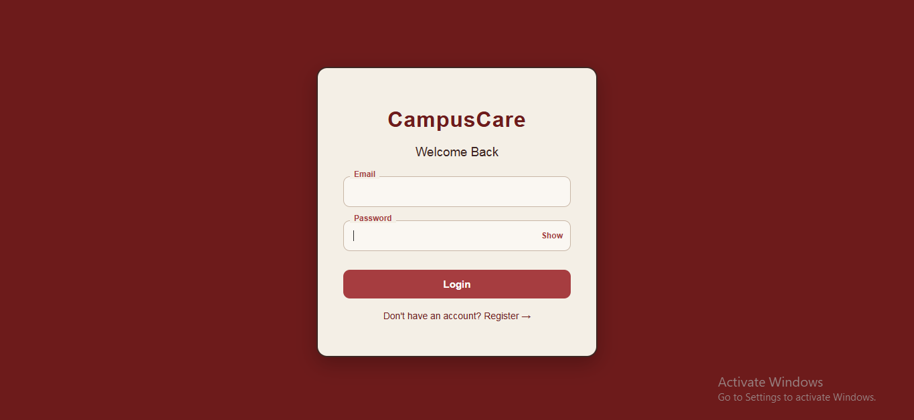
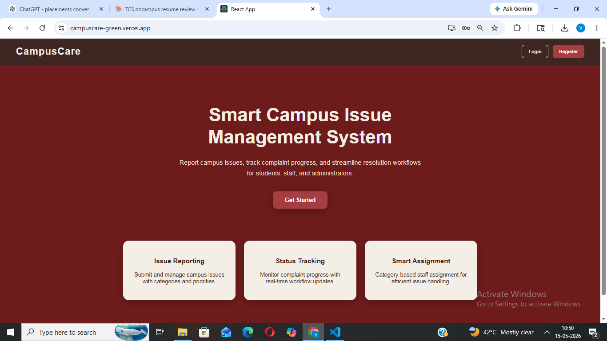

 CampusCare – Institute Issue Management System

A full-stack MERN application that allows students, staff, and administrators to report, track, and resolve institute-related issues through a centralized platform.

🔗 Live Demo: [campuscare-green.vercel.app](https://campuscare-green.vercel.app)

---

 Features

- Role-based authentication** – Separate dashboards for students, staff, and administrators
- Issue reporting** – Students can submit issues with category and priority
- Status tracking** – Real-time workflow updates on complaint progress
- Category-wise filtering** – Filter issues by type for efficient handling
- Smart assignment** – Category-based staff assignment for issue resolution
- JWT-based secure auth** – Protected routes with JSON Web Tokens

---

Tech Stack

| Layer | Technology |
|-------|-----------|
| Frontend | React.js, CSS |
| Backend | Node.js, Express.js |
| Database | MongoDB (Atlas) |
| Auth | JWT (JSON Web Tokens) |
| Deployment | Vercel |

---

Project Structure

```
campus-issue-system/
├── config/
│   └── db.js               # MongoDB connection
├── controllers/
│   ├── issue.js            # Issue logic
│   └── user.js             # User logic
├── middleware/             # Auth middleware
├── models/                 # Mongoose schemas
├── routes/                 # API routes
├── frontend/
│   └── src/
│       ├── pages/          # Login, Register, Dashboards
│       ├── components/     # Navbar
│       └── services/       # API calls
├── app.js                  # Entry point
└── package.json
```

---

## Getting Started (Local Setup)

### Prerequisites

- Node.js installed
- MongoDB Atlas account (or local MongoDB)

### 1. Clone the repository

```bash
git clone https://github.com/vaishnavi11-tech/campuscare.git
cd campuscare
```

### 2. Set up environment variables

Create a `.env` file in the root directory:

```env
MONGO_URI=your_mongodb_connection_string
JWT_SECRET=your_jwt_secret_key
```

### 3. Install backend dependencies

```bash
npm install
```

### 4. Install frontend dependencies

```bash
cd frontend
npm install
```

### 5. Run the application

In the root folder (backend):
```bash
npm start
```

In the frontend folder:
```bash
npm start
```

Backend runs on `http://localhost:5000`  
Frontend runs on `http://localhost:3000`

---

## Screenshots

### Landing Page


### Login Page


---

## API Endpoints

| Method | Endpoint | Description |
|--------|----------|-------------|
| POST | `/api/users/register` | Register a new user |
| POST | `/api/users/login` | Login and get JWT token |
| GET | `/api/issues` | Get all issues |
| POST | `/api/issues` | Create a new issue |
| PUT | `/api/issues/:id` | Update issue status |

---

## Author

**Vaishnavi Banbare**  
GitHub: [@vaishnavi11-tech](https://github.com/vaishnavi11-tech)  
LinkedIn: [vaishnavi-banbare](https://linkedin.com/in/vaishnavi-banbare-7200a2385)